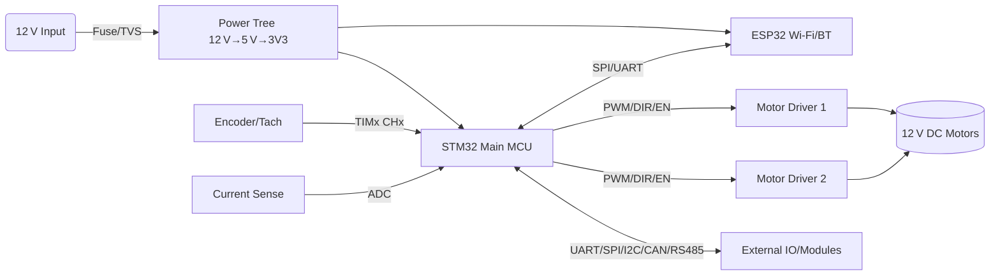

# STM32 Central Controller Board with ESP32
A compact central controller based on **STM32** with an integrated **ESP32** co‑processor. The board drives **12 V DC motors** through external driver modules and exposes multiple industrial interfaces for expansion and telemetry.

> Purpose: act as the hub that coordinates motor drivers and peripherals in robotics and automation projects.

---

## 1) Key Features
- STM32 MCU (F4/F7 class recommended), 168–216 MHz, FPU, timers rich for PWM and capture.
- ESP32 (WROOM‑32 or C3/WROOM‑32E) for Wi‑Fi/BT, OTA, and MQTT/REST bridge.
- Motor control hub for **DC 12 V** motors via external drivers (BTS7960, VNH5019, DRV8871, or similar).
- Rich I/O: UART ×3, SPI ×2, I²C ×2, CAN FD (via transceiver), RS‑485 (MAX3485/ISL83485), optional Ethernet PHY.
- Sensing: motor current (shunt or driver ISEN) to ADC, tachometer/encoder to timer inputs, NTC/LM75/TMP117 temperature.
- Power tree: 12 V input → 5 V buck → 3.3 V LDO/buck; reverse‑polarity, TVS, fuse, and brown‑out.
- Debug: SWD, USB‑CDC, RGB status LED, user button, boot jumpers.
- Firmware: HAL/LL + FreeRTOS; modular drivers; command protocol over UART/CAN; ESP32 Wi‑Fi gateway.
- Safe stop: hardware **EN** line, E‑Stop input, watchdog, and over‑current trip (firmware + hardware).

---

## 2) System Overview


---

## 3) Hardware Specification
### 3.1 MCU and Clock
- STM32F407/411/446/767 (pin‑compatible LQFP100/144 variants are fine).  
- HSE 8–25 MHz crystal; optional LSE 32.768 kHz for RTC; SysClk 168–216 MHz.
- Brown‑out 2.7–3.0 V enabled.

### 3.2 ESP32 Subsystem
- ESP32‑WROOM‑32 on UART or SPI to STM32.  
- 3V3 supply budget ≥ 500 mA peak. Antenna keep‑out per module datasheet.  
- Boot strapping: IO0, EN pull‑ups; 6‑pin UART/EN/IO0 header for flashing.

### 3.3 Power
- VIN: 9–16 V nominal, recommended 12 V.  
- Buck 12 V→5 V (≥ 3 A) for drivers/aux; 5 V→3.3 V (≥ 1 A) for logic.  
- Protections: reverse polarity (MOSFET or diode), TVS SMAJ58A at VIN, resettable fuse, LC input filter.  
- Star‑ground between **power ground** and **logic ground** with single‑point tie at shunt/return.

### 3.4 External Motor Drivers (not on board)
- Supported: BTS7960, VNH5019, DRV8871, TB6612FNG, etc.  
- Control lines per channel:
  - `PWMx` (TIMx CHy), `DIRx` (GPIO), `ENx` (GPIO, active high), `FAULTx` (GPIO in), `ISENx` → ADC.
  - Encoders: `CHA`, `CHB` to timer encoder mode; or single tachometer to input capture.

### 3.5 Connectors (example)
| Group | Signal | STM32 Pin | Notes |
|---|---|---|---|
| Motor 1 | PWM1 | `TIM1_CH1 PA8` | 20 kHz default |
|  | DIR1 | `PB0` | Output |
|  | EN1 | `PB1` | HW enable |
|  | FAULT1 | `PC4` | Input pull‑up |
|  | ISEN1 | `ADC1_IN10 PC0` | 0–3.3 V |
| Encoder 1 | CHA1 | `TIM3_CH1 PA6` | Encoder mode |
|  | CHB1 | `TIM3_CH2 PA7` |  |
| Motor 2 | PWM2 | `TIM1_CH2 PA9` | 20 kHz |
|  | DIR2 | `PB2` |  |
|  | EN2 | `PB10` |  |
|  | FAULT2 | `PC5` |  |
|  | ISEN2 | `ADC1_IN11 PC1` |  |
| Comm | UART0 | `USART1 PA9/PA10` | To ESP32 |
|  | UART1 | `USART3 PB10/PB11` | External |
|  | RS‑485 | `USART2 PA2/PA3` + DE `PA1` | MAX3485 |
|  | CAN | `CAN1 RX PA11 TX PA12` | ISO1050/TCAN |
|  | I²C | `I2C1 PB6/PB7` | Sensors |
|  | SPI | `SPI1 PA5/PA6/PA7` | External |
| Debug | SWD | `SWDIO/SWCLK/NRST` | 10‑pin |
| IO | BTN | `PC13` | User |
|  | LED | `PA5` | Status RGB optional |

> Adjust pins to your exact MCU package. Keep PWM on advanced timers (TIM1/TIM8) for dead‑time if later moving to H‑bridge.

---

## 4) Firmware Architecture
### 4.1 STM32 (FreeRTOS)
- **Tasks**
  - `MotorCtrlTask` 1 kHz: read setpoints, run PI/PID, write PWM/DIR/EN.
  - `SenseTask` 1–2 kHz: ADC DMA, current/voltage/temp filtering.
  - `CommTask` 100–500 Hz: parse commands on UART/CAN/RS‑485.
  - `SafetyTask` 100 Hz: watchdog, E‑Stop, over‑current, brown‑out flags.
  - `LoggerTask` 10–50 Hz: publish telemetry to ESP32 or USB‑CDC.
- **Drivers**: HAL LL for timers (PWM + encoder + input capture), DMA for ADC/UART/SPI.

### 4.2 ESP32
- Wi‑Fi/MQTT or REST. Bridges commands to STM32 over UART:
  - Rate limiting, reconnection, OTA updates, TLS if needed.

---

## 5) Command Protocol
Binary, little‑endian. Example:
```
| 0xAA | 0x55 | CMD | LEN | PAYLOAD... | CRC8 |
```
- `CMD=0x01`: Set motor setpoint
  - Payload: `u8 motor_id, i16 speed_rpm, u8 mode` (`mode`: 0=open‑loop PWM, 1=closed‑loop RPM).
- `CMD=0x02`: Enable/disable
  - Payload: `u8 motor_id, u8 enable`
- `CMD=0x10`: Telemetry request
  - Payload: none → board replies with currents, voltages, RPM, temps.
- CRC8 polynomial 0x07.

MQTT topics on ESP32:
```
cmd/<board_id>/#
tele/<board_id>/state
```

---

## 6) Motor Control Notes
- PWM frequency 20–25 kHz to move above audible. Center‑aligned PWM preferred.
- For closed‑loop RPM: `RPM = (freq_capture * 60) / pulses_per_rev`.
- Current limit: trip on `ISENx > I_limit` for > N samples; latch with FAULT until clear.
- Soft‑start: ramp PWM from 0→target in `t_ramp` to reduce inrush.
- Direction changes: enforce dead‑time `t_dead` and 0‑PWM window before toggling `DIR`.

---

## 7) Power and EMC
- Keep high‑di/dt motor paths short, separate from logic. Use RC snubbers or diode clamps as required by driver.
- Star ground and Kelvin sense for shunt. Analog front‑end RC 1–10 kΩ / 100 nF before ADC.
- TVS at VIN and at connector edges. Common‑mode chokes on RS‑485/CAN/Ethernet if placed.
- Decoupling: 100 nF per digital pin cluster, bulk 47–220 µF per rail near loads.

---

## 8) Repository Layout
```
.
├─ hardware/
│  ├─ schematics/
│  └─ pcb/
├─ firmware/
│  ├─ stm32/
│  │  ├─ Core/ (CubeMX)
│  │  ├─ Drivers/
│  │  └─ App/ (tasks, protocol)
│  └─ esp32/
│     ├─ main/
│     └─ components/
├─ tools/
│  └─ scripts/ (flash, log, pack)
└─ docs/
   └─ images/
```

---

## 9) Build & Flash
### 9.1 STM32
- Prereq: **STM32CubeMX**, **ARM GCC** or Keil, **CubeProgrammer**.
- Generate project with TIM, ADC DMA, UART, I²C, SPI, CAN enabled.  
- Build:
  ```bash
  make -C firmware/stm32
  ```
- Flash (USB ST‑Link or DFU):
  ```bash
  STM32_Programmer_CLI -c port=SWD -w build/app.hex -v -rst
  ```

### 9.2 ESP32
- Prereq: **ESP‑IDF**.
  ```bash
  idf.py set-target esp32
  idf.py build
  idf.py -p COMx flash monitor
  ```

---

## 10) Quick‑Start
1. Supply 12 V to VIN. Check 5 V and 3V3 rails.
2. Connect external motor driver to PWM/DIR/EN/ISEN and 12 V motor line.
3. Flash STM32 and ESP32 images.
4. Open USB‑CDC or MQTT. Send command to enable motor and set setpoint.
5. Verify telemetry values and adjust `pulses_per_rev`, current limit, and PID gains.

---

## 11) Safety Checklist
- E‑Stop wired and tested.
- Over‑current trip verified at bench with dummy load.
- Direction change dead‑time validated.
- Watchdog resets on task stall.
- Thermal sensors calibrated.

---

## 12) BOM Guidance (partial)
- Buck 12 V→5 V: 3–5 A synchronous module (e.g., MP1584, TPS5430 class).  
- 5 V→3V3: 1–2 A buck (e.g., MP2145) or LDO if <300 mA.  
- RS‑485: MAX3485/ISL83485 + TVS (SM712).  
- CAN: TCAN1042/1051 isolated optional.  
- TVS: VIN SMAJ58A, IO ESD9x series.  
- Connectors: 2‑pin VIN, 4‑pin motor driver header per channel, JST‑GH for encoders.

---

## 13) Configuration
`firmware/stm32/App/config.h`
```c
#define PWM_FREQ_HZ              20000
#define PULSES_PER_REV_M1        6
#define CURRENT_LIMIT_A_M1       8.0f
#define T_RAMP_MS                200
#define DEADTIME_MS              50
```
`firmware/esp32/main/config.h`
```c
#define WIFI_SSID "YOUR_SSID"
#define WIFI_PASS "YOUR_PASS"
#define MQTT_BROKER "mqtt://192.168.1.10"
#define BOARD_ID "ctrl‑01"
```

---

## 14) Test Procedures
- Loop test: command PWM 10/30/60/90 %, log current and RPM, check linearity.
- Step response: 0→target and target→0, calculate rise/settling time.
- Stall test at low duty to confirm current limit behavior.
- Comms soak: 24 h publish at 10 Hz with error rate < 0.1 %.

---

## 15) License
MIT. Replace as needed.

---

## 16) Notes
- Replace pin map with your final CubeMX assignments.
- Keep ESP32 antenna area clear of copper and enclosures.
- If you add Ethernet: RMII pins require a 50 MHz ref clock and careful routing.
